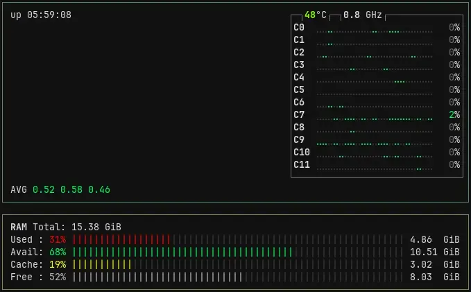

# ptop


Personal Tabel of Processes (**ptop**) é um monitor de recursos de sistema focado em performance. Escrito em C, sem dependências externas além da biblioteca padrão.

Inspirado na estética do [btop](https://github.com/aristocratos/btop).

| ptop (WIP) | btop (Original) |
| :---: | :---: |
|  |  |

## Instalação

```bash
# 1. Clone o repositório
git clone https://github.com/pedroivo1/ptop.git
cd ptop

# 2. Compile (Otimizado para sua arquitetura)
make release

# 3. Execute
./ptop
```

## Controles

| Tecla | Ação |
| :---: | :--- |
| `q` | Sair |
| `1` | Ligar/Desligar CPU |
| `2` | Ligar/Desligar Memória |
| `t` | Trocar Tema |
| `r` | Forçar Redesenho |

## License

[GPLv2](LICENSE)
