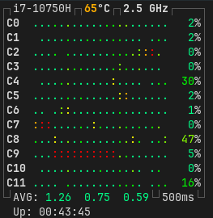
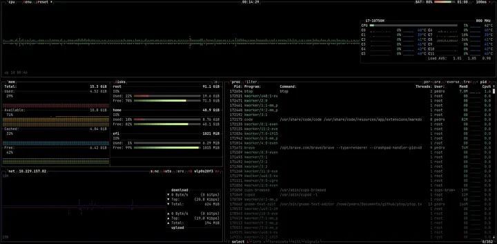

# ptop


Um monitor de recursos de baixo consumo, inspirado no [btop](https://github.com/aristocratos/btop), escrito puramente em C (sem ncurses).

| ptop (WIP) | btop (Original) |
| :---: | :---: |
|  |  |

## Funcionalidades
- **Monitoramento de CPU:** Exibe temperatura, frequência, Load Average e uso detalhado por núcleo.
- **Gráficos em Tempo Real:** Histórico visual de processamento usando caracteres Braille de alta precisão.
- **Interface Responsiva:** O layout se adapta e centraliza automaticamente ao redimensionar a janela.
- **Uptime:** Mostra o tempo total de atividade do sistema.

## Diferenciais Técnicos
* **Zero Bloat:** Escrito em C puro, sem dependências pesadas (como ncurses).
* **TrueColor:** Renderização visual rica com suporte a gradientes reais via ANSI escape codes.
* **Alta Performance:** Alocação estática de memória e *syscalls* minimizadas (buffer manual) para latência zero, etc.

## Configuração
O projeto é focado em performance hardcoded. Antes de compilar, edite `src/cfg.h` para ajustar ao seu hardware:

- **CORES_N:** Defina o número total de threads da sua CPU (vCPUs).
- **PHY_CORES_N:** Defina o número de núcleos físicos da sua CPU.
- **HWMON_N:** Defina o número máximo de pastas (interfaces) a serem escaneadas em `/sys/class/hwmon/`.
- **DELAY_MS:** Tempo de atualização em milissegundos (não ponha menos do que 100ms, o código aguanta, mas o seu olho não acompanha essa taxa de atualização).

## Instalação e Uso
Basta compilar com `make`:

```bash
make
./ptop
```
